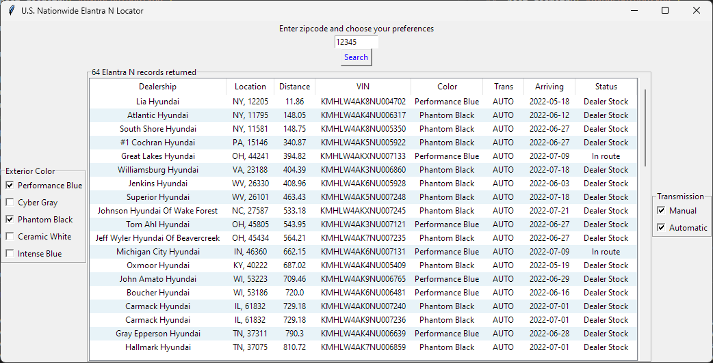

# Hyundai-USA-Inventory-Locator
https://www.reddit.com/r/ElantraN/comments/u9wq03/nationwide_elantran_locator/ 


How to use
-------------

Download Release file to get Mac Application & Windows Executable. It is under /ElantraN/Executables.

History
-------------

2022-04-22 Started Project, Finished Elantra N version

## If you want to customize the program (setting the default selection)

0. Install python (at least 3.10) and pip

https://www.python.org/downloads/

https://phoenixnap.com/kb/install-pip-windows

1. Open Elantra.py

2. Line 97, enter your zipcode
   
   ```
   zipText.insert(0,"11111")
   ```

3. Line 78, change array index to set default exterior color
   
   ```
   ColorB[0].select()
   ```
   
   Color choices are:
* Performance Blue ```ColorB[0].select()```

* Cyber Gray ```ColorB[1].select()```

* Phantom Black ```ColorB[2].select()```

* Ceramic White ```ColorB[3].select()```

* Intense Blue ```ColorB[4].select()```
4. Line 137, enter transmission type
   
   ```
   TransB[1].select()
   ```
   
   Choices are:
* Automatic ```TransB[1].select()```

* Manual ```TransB[0].select()```
5. Save and exit

6. Locate your termial to the folder where Elantra.py is.

7. Install pyinstaller
   
   ```
   pip install pyinstaller
   ```

8. Make executable

```
pyinstaller -w -F ElantraN.py
```

9. You will have your working program under the dist folder. You can erase the rest.
